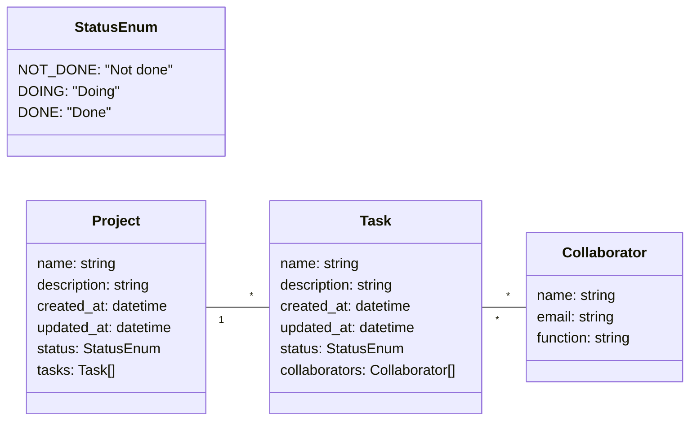

```mermaid
classDiagram
  direction LR
  class Collaborator {
    name: string
    email: string
    function: string
  }
  class StatusEnum {
    NOT_DONE: "Not done"
    DOING: "Doing"
    DONE: "Done"
  }
  class Task {
    name: string
    description: string
    created_at: datetime
    updated_at: datetime
    status: StatusEnum
    collaborators: Collaborator[]
  }
  class Project {
    name: string
    description: string
    created_at: datetime
    updated_at: datetime
    status: StatusEnum
    tasks: Task[]
  }
  Project "1"-- "*" Task
  Task "*" -- "*" Collaborator


```